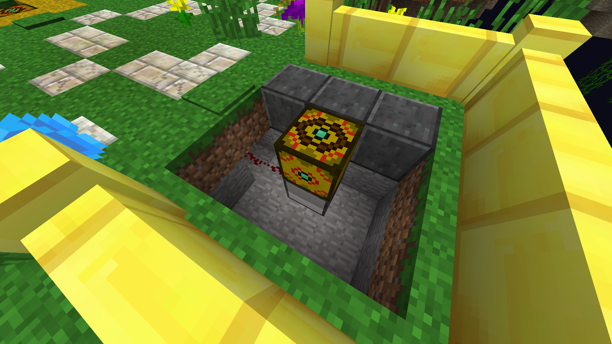
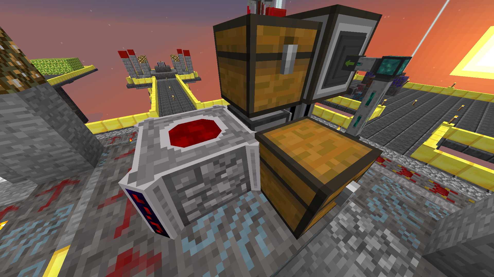
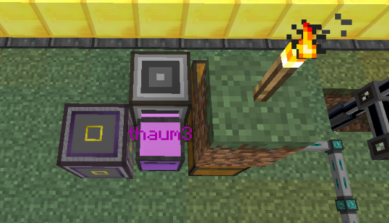

# FTB Skyblock Skripte

There's also an [English](doc/README.eng.md) version of this overview.

In diesem Repository sind alle Skripte, die ich aktuell in meinem Projekt [FTB Skyblock](https://www.youtube.com/playlist?list=PL9oBXB6tQnlX013V1v20WkfzI9R2zamHi) verwende. 

Wenn du eins der Skripte selbst verwenden möchtest, stelle den Aufbau der Bilder in deiner Welt nach und nutze den Befehl `pastebin get {id} startup` und ersetze `{id}` durch einen der Pastebin-Codes weiter unten!

Wichtig: FTB Skyblock wird in der Minecraft-Version `1.7.10` gespielt. In anderen Versionen könnten die Skripte nicht funktionieren!
Zum Kopieren nach Minecraft kannst du auch mein Tool aus Jahre 2013 nutzen: [C3P-Download](http://www.mediafire.com/file/d8k3t9d1h9chs0s/C3P-1.0.2.2.zip/file)

## Portal
**[Pastebin](https://pastebin.com/3DhtLbmF)-ID: `3DhtLbmF`**

*Befehl: `pastebin get 3DhtLbmF startup`*

Dieses Skript wartet auf einen Redstone-Impuls (von hinten) und triggert dann ein Portal (auf dem Computer). Nach fünf Sekunden wird das Portal erneut aktiviert.

Video zum Skript: [FTB Skyblock Folge 271](https://www.youtube.com/watch?v=5FlJwbOFivo)

## Bloodmagic
**[Pastebin](https://pastebin.com/0fNq0Rj9)-ID: `0fNq0Rj9`**

*Befehl: `pastebin get 0fNq0Rj9 startup`*

Dieses Skript dient zum Autocrafting mit Blood Magic. Eine Turtle überwacht den Inhalt einer Kiste. Werden Items gefunden, bewegt die Turtle diese in den Altar vor ihr und überwacht den Fortschritt der Transmutation. Sobald diese abgeschlossen ist, nimmt die Turtle das Item entgegen und legt es in eine weitere Kiste.

Video zum Skript: [FTB Skyblock Folge 207](https://youtu.be/JVBjpzzMEmo)

## Essentia
**[Pastebin](https://pastebin.com/uCzuziUt)-ID: `uCzuziUt` & `THhWPmBk`**

*Befehl: `pastebin get uCzuziUt essentia`* und `pastebin get THhWPmBk start`

Dieses Skript fragt über den benachbarten Essentia-Provider ab, von welcher Essenz zu wenig im ME-System ist (weniger als der Grenzwert, z.b. 2048). Wenn ein Defizit von Essenzen erkannt wird, wird automatisch etwas *Ethereal essence* mittels des benachbarten ME-Interfaces in eine Kiste exportiert (siehe Aufbau). Eine ausreichend performante Wisp-Farm wird vorausgesetzt. Da dieses Skript manchmal aus bisher unbekannten Gründen mit einer Java-Exception abstürzt, kann das zweite Skript `essentia-start` genutzt werden, um den Vorgang von vorne zu starten.

Vorsicht: Dieses Skript kann den Server durch Blockupdates zum Absturz bringen! Benutzung nur in Maßen!

PS: Violette Turtle Namen bekommt man mit dem Befehl: `os.setComputerLabel(string.char(194,167) .. "5turtlename")`

Video zum Skript: [FTB Skyblock Folge 286](https://www.youtube.com/watch?v=EVEgyugdLgU)

